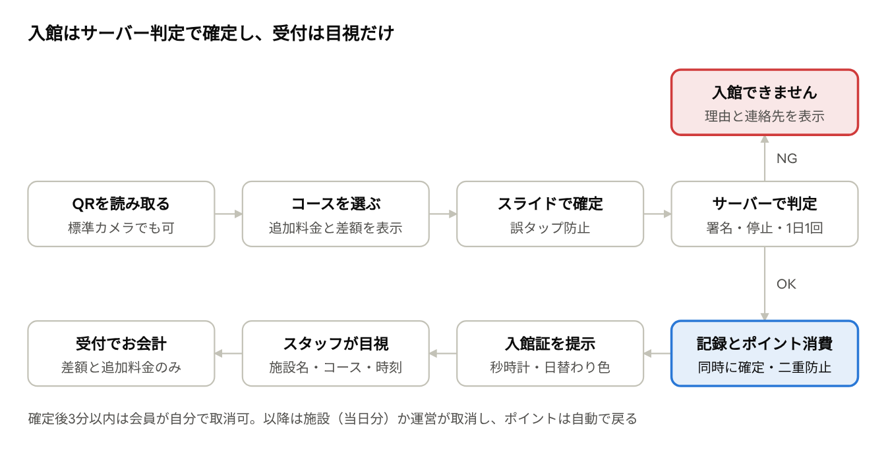
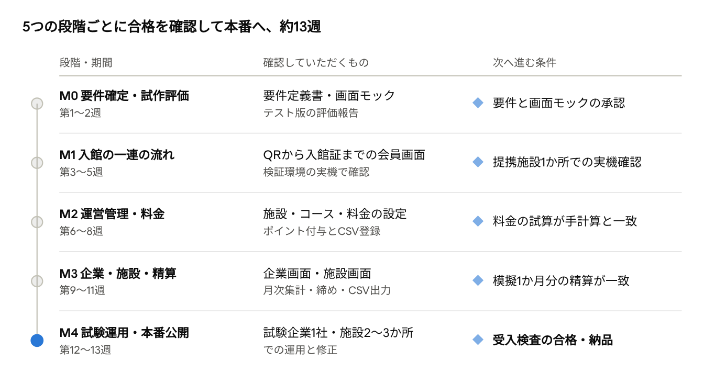

# 温浴施設 福利厚生サービス 要件定義書（案）

2026-10-07

## 1. 概要

本システムは「企業が費用を負担し、従業員が提携温浴施設を月ごとのポイントで利用し、運営者が施設へ精算する」三者間の福利厚生プラットフォームです。中核は、施設に端末を置かずに、来館の事実を改ざんしにくい形で記録し、月末に正確な精算額を出すことです。

### 関係者と主な関心事

| 関係者 | 使う画面 | 主な関心事 |
| --- | --- | --- |
| 会員（導入企業の従業員） | スマホのブラウザ（会員証） | 迷わず入館できる、残りポイントが分かる、追加料金で揉めない |
| 施設フロントスタッフ | 会員のスマホ画面を目視（端末なし） | 数秒で本物か判断できる、混雑時に列を止めない |
| 施設運営者（提携施設） | 施設管理画面（PC） | 当日の来館一覧、月次の精算額の確認、料金の届け出 |
| 導入企業の人事・総務 | 企業管理画面（PC） | 会員の入退社反映、利用状況の把握（個人の行動は見すぎない） |
| 運営事務局（発注者） | 運営管理画面（PC） | 契約・料金・精算比率の設定、不正の検知、請求と支払の根拠データ |

### 本書の位置づけ

- 依頼文の機能一覧を、業界の定石と運用上の落とし穴で補い、受託側として提案する要件案です。
- 「必須（MVP）」「推奨」「将来」の3段階で優先度を付けています。予算と納期の調整はこの区分で行います。
- 事業の詳細（料金体系、精算条件）はNDA締結後に確定させる前提で、仮置きの値は明記しています。

## 2. 業界のベストプラクティスと本件での採用方針

最も重要な判断は、「入館の正しさはスクリーンの見た目ではなく、サーバーの記録で担保する」ことです。秒時計はスタッフが一瞬で見分けるための補助であり、精算の根拠は全てサーバー側の入館記録とポイント台帳に置きます。以下は、電子チケット、法人向け福利厚生サービス、温浴施設の利用券運用で一般的に取られている定石を、本件に当てはめたものです（個別サービスの調査ではなく、一般的な知見に基づく整理）。

| 論点 | 定石 | 本件での採用 |
| --- | --- | --- |
| 施設に貼るQR | QRは「場所の識別子」として使い、それ自体に価値を持たせない | QRには署名付きの施設IDのみ。撃っただけでは何も消費されず、「コース選択→確定」で初めて入館が成立 |
| QRの持ち出し対策 | 写真で持ち帰られた静的QRは遠隔入館に悪用される前提で設計する | 複数の弱いシグナルを重ねる（第4章）。位置情報は必須にしないが、取れた場合は記録し異常検知に使う |
| 画面の使い回し対策 | 「動き」と「日替わり」の二重。秒時計だけでは動画録画で突破される | 秒時計＋日替わりの色と印（同日は全会員が同じ色、施設には当日の色を事前共有しない）＋入館確定からの経過時間表示 |
| スタッフの確認 | 受付は3秒で判断。確認項目は大きく、少なく | 施設名・コース名・当日の追加料金・入館時刻の4点のみを大きく表示。氏名は小さく（他客からの視認配慮） |
| 料金の改定 | 料金は「適用開始日付きの版」で管理し、入館時点の値を記録に写し取る | 料金・精算比率は全て履歴管理。改定しても過去の精算額は変わらない |
| 日付の区切り | 深夜営業の施設は「営業日」が暦日とずれる | 営業日の切替時刻を施設ごとに設定（例: 朝5時）。土日祝判定・1日1回制限は営業日で判定 |
| 祝日と特定日 | 法定祝日と、GW・お盆・年末年始など施設独自の繁忙期料金を分けて持つ | 内閣府の祝日データを年次で取り込み、施設ごとの「特別料金日」カレンダーを追加 |
| ポイントの会計 | 残高を上書きせず、付与・使用・取消・失効を全て台帳に追記する | 追記型のポイント台帳。残高は台帳から計算し、「なぜこの残高か」を常に説明できる |
| ポイントの有効期限 | 月次付与の福利厚生ポイントは当月限りが多い。未使用残高の負債管理が不要になる | 初期値は「当月末失効」。繰越の有無と上限を企業契約ごとに設定可能にする |
| 精算の確定 | 月次は「仮集計→施設確認→確定（ロック）」。確定後の誤りは翌月に調整行で直す | 確定後の取消は翌月のマイナス行として計上。過去の確定帳票は書き換えない |
| 会員のプライバシー | 企業に個人の利用日時や場所を見せると利用が萎縮する | 企業画面は集計値（利用人数・回数）を標準とし、個人別の明細は契約で合意した場合のみ開示 |
| 不慣れな利用者 | アプリではなく、初回以降はログイン不要に近づける | 招待メールから初回設定、以降は長期ログイン保持。ホーム画面への追加を画像付きで案内 |
| 通信が弱い受付 | 地下や建物奥のフロントは電波が弱いことが多い | 入館画面は軽量に。通信失敗時は「まだ入館していません」を明示し、二重消費を防ぐ再送設計（冪等キー） |

法務面の注意: 会員が自分で購入できない無償付与のポイントは、一般に資金決済法の前払式支払手段に当たりにくいとされます。ただし「会員が自費でポイントを買い足す」機能を将来入れる場合は専門家の確認が必要です。

## 3. 機能要件

画面は4つ（会員・提携施設・導入企業・運営）に分け、各機能に優先度を付けました。依頼文にない追加提案は「追加」と明記しています。

### 3.1 会員画面（スマホのブラウザ）

| ID | 機能 | 要件 | 優先度 |
| --- | --- | --- | --- |
| M-01 | ログイン | 企業登録で届く招待メールから初回パスワード設定。以降は90日間ログイン保持。パスワード再設定。連続失敗で一時ロック | MVP |
| M-02 | 会員証 | 氏名・会社名・残りポイント・秒まで動く現在時刻。追加で日替わりの色と印、ポイントの有効期限 | MVP |
| M-03 | QR読取 | 施設QRはURL形式。スマホ標準カメラで読んでも会員画面の該当施設に直接入れる。会員画面内のカメラ起動ボタンも用意 | MVP |
| M-04 | コース選択 | 施設のコース一覧。各コースに必要ポイント、含まれるもの（館内着・タオル・岩盤浴など）、利用時間を表示 | MVP |
| M-05 | 追加料金の事前告知 | 「本日は祝日のため +300円を受付でお支払いください」のように、理由と金額を確定前に表示。深夜帯にかかる場合は「1時00分以降ご滞在で+○円」と条件で示す | MVP |
| M-06 | 不足時の表示 | 残高が足りない場合、不足分を円で表示し「店頭払い」と明記。入館自体は可能 | MVP |
| M-07 | 入館確定 | 誤タップ防止のため「スライドして入館」。確定前に合計（消費pt・店頭払い額）を再掲 | MVP |
| M-08 | 入館証（受付提示画面） | 施設名・コース・店頭払い額・入館時刻・経過時間・秒時計・日替わり色。当日中は会員証からいつでも再表示可 | MVP |
| M-09 | 利用履歴 | 入館日時・施設・コース・消費pt・取消の有無。ポイントの付与・失効も同じ一覧に出す | MVP |
| M-10 | 施設を探す（追加） | 提携施設の一覧・地図・営業時間・休館日・本日の追加料金。「行ってみたが休みだった」を防ぐ | 推奨 |
| M-11 | 誤入館の自己取消（追加） | 確定後3分以内なら会員自身で取消可能。それ以降は施設または運営が取消 | 推奨 |
| M-12 | 使い方ガイド（追加） | 初回のみ3枚のガイド（ホーム画面への追加方法を含む）。iPhone/Androidで手順を切替 | MVP |
| M-13 | お知らせ（追加） | 新規提携施設、臨時休館、料金改定のお知らせ | 推奨 |

### 3.2 提携施設画面（PC・タブレット）

施設に端末設置を求めない前提のため、事務所のPCから必要なときに開く画面として設計します。受付業務は画面を使わず、会員のスマホを見るだけで完結します。

| ID | 機能 | 要件 | 優先度 |
| --- | --- | --- | --- |
| F-01 | 本日の入館一覧 | 入館時刻・会員の姓・コース・店頭払い額。レジ締めとの照合に使う | MVP |
| F-02 | 入館の取消 | 当日分は施設で取消可（理由必須）。翌日以降は運営への取消申請 | MVP |
| F-03 | 月次精算の確認 | 仮集計の確認、異議申立、確定後の支払通知書（PDF）と明細CSV | MVP |
| F-04 | QR掲示物の出力 | A4ポスターと卓上POPのPDF。「こちらを読み取ってください」と手順図入り | MVP |
| F-05 | スタッフ向け確認ガイド | 受付裏に貼る1枚物（本物の見分け方、異常時の連絡先） | MVP |
| F-06 | 料金・営業情報の変更申請 | 営業時間・臨時休館・特別料金日を施設が申請し、運営が承認して反映 | 推奨 |
| F-07 | 複数店舗の一括管理 | 運営会社単位のログインで配下店舗を切替 | 推奨 |

### 3.3 導入企業画面（PC）

| ID | 機能 | 要件 | 優先度 |
| --- | --- | --- | --- |
| C-01 | 会員の登録 | 個別登録とCSV一括登録。CSVは「検証→差分プレビュー（新規・変更・停止の件数）→反映」の3段階。エラー行は理由付きでダウンロード | MVP |
| C-02 | 退職・休職の反映 | 利用停止日を指定して予約。停止日以降は入館不可、残ポイントは失効 | MVP |
| C-03 | 招待の再送 | 未ログイン者の一覧と招待メールの一括再送 | MVP |
| C-04 | 利用状況 | 月別の利用人数・延べ回数・利用率（利用人数÷会員数）。個人別は契約で合意した場合のみ | MVP |
| C-05 | 請求明細 | 月次の請求額の根拠CSV | MVP |
| C-06 | 担当者の複数登録・事業所別集計 | 部署・事業所コードでの絞り込み | 推奨 |
| C-07 | 社内周知キット | 従業員向け案内PDF（会社名入り）と社内メール文例 | 推奨 |

### 3.4 運営管理画面（PC）

| ID | 機能 | 要件 | 優先度 |
| --- | --- | --- | --- |
| A-01 | 企業・契約の管理 | 契約期間、月次付与ポイント、繰越ルール、1日の利用上限、利用可能施設の範囲 | MVP |
| A-02 | 会員の管理 | 検索・個別編集・CSV一括登録（C-01と同じ仕組み）・利用停止 | MVP |
| A-03 | 施設・コースの管理 | 施設情報、営業時間、営業日の切替時刻、コース（必要pt・施設定価・含まれるもの・表示順・公開期間） | MVP |
| A-04 | 追加料金ルール | 曜日・祝日・特別料金日・時間帯の組合せで加算額を定義。「この日のこの時刻ならいくらか」を試算できるプレビュー付き | MVP |
| A-05 | 精算条件 | 施設・コースごとの精算比率または精算単価。適用開始日付きで履歴管理 | MVP |
| A-06 | 祝日カレンダー | 法定祝日の年次取込と手動修正 | MVP |
| A-07 | QRの発行 | 施設ごとに署名付きQRを発行。再発行すると旧QRは猶予期間後に無効。掲示物PDFを生成 | MVP |
| A-08 | 入館記録 | 検索（期間・企業・施設・会員）、詳細（端末・位置などの参考情報）、取消（理由必須、ポイントは自動で戻る） | MVP |
| A-09 | ポイントの自動付与 | 毎月1日0時（日本時間）に実行。再実行しても二重付与しない。実行結果をメール通知 | MVP |
| A-10 | ポイントの手動調整 | 理由必須で加減算。台帳に記録 | MVP |
| A-11 | 月次集計 | 企業別の利用人数・回数、施設別の精算額。CSV出力（Excelで文字化けしない形式） | MVP |
| A-12 | 月次締め | 仮集計→施設確認期間→確定（ロック）。確定後の取消は翌月の調整行 | MVP |
| A-13 | 不正の検知 | 第4章のルールに該当した入館を一覧化し、確認済みにできる | 推奨 |
| A-14 | 操作ログ | 管理者の登録・変更・取消を全て記録（誰が・いつ・何を・変更前後） | MVP |
| A-15 | 権限管理 | 運営管理者／運営担当（精算確定不可）／閲覧のみ | MVP |
| A-16 | お知らせ配信 | 全会員／企業別／施設利用者別 | 推奨 |
| A-17 | 請求書・支払通知書の自動作成 | インボイス制度の記載事項に対応したPDF | 将来 |
| A-18 | 企業のSSO・人事システム連携 | Google/Microsoftアカウントでのログイン、入退社の自動反映 | 将来 |

### 3.5 ポイントと料金のルール（初期値の提案）

- 付与: 毎月1日0時に契約で定めたポイントを付与。月途中の入会者は「登録日に当月分を全額付与」または「翌月1日から」を契約ごとに選択。
- 失効: 初期値は当月末失効。失効も台帳に記録し、会員には「今月末まで」と常に表示。
- 1日1回: 営業日単位で、全施設合計で1回。取消された入館は回数に数えない。
- 不足時: 残高を全て使い、足りない分を円換算して店頭払い。換算率（1pt=1円など）は設定値。
- 追加料金: ポイントでは払わず、常に店頭払い。入館時点の金額を記録に写し取る。

施設への精算額は、入館時点の設定を使って次のように計算します（式の形は設定で切替可能にし、NDA後に確定）。

```latex
\text{精算額} = \text{使用ポイント} \times \text{換算率} \times \text{精算比率}
```

店頭で受け取った不足分と追加料金は施設の売上であり、精算には含めません。代わりに「施設定価 × 精算比率」で支払う方式も選べるようにします。

## 4. 入館フローと不正防止

会員の操作は「読む・選ぶ・スライドする」の3歩です。入館の成立とポイント消費はサーバーが1回の処理で同時に確定し、受付スタッフはその結果を目で確かめるだけです。



判定で不可となるのは、QRの署名不一致・会員の利用停止・同じ営業日の2回目・施設の休館日の4つです。残高不足は不可にせず、差額を店頭払いとして入館させます。

### 4.1 想定される不正と対策

| 想定される不正 | 対策 | 優先度 |
| --- | --- | --- |
| 入館証のスクリーンショットや録画の使い回し | 秒時計、サーバーが当日に決める日替わり色と印、入館からの経過時間。前日以前の画面は色で見分けられる | MVP |
| 施設QRを撮影して持ち帰り、遠隔で入館 | 入館は経過時間付きで表示され、受付での提示が無ければ成立しない運用。位置情報が取れた場合、施設から遠い入館に要確認印。QRは年次などで再発行可能 | MVP（位置は推奨） |
| アカウントの貸し借り | 入館証に氏名を表示。同時にログインできる端末は2台まで。端末の入れ替わりを記録 | MVP |
| 同じ日に2回入館 | 「会員×営業日」の一意制約でDBが拒否 | MVP |
| 二重タップや通信の再送で二重消費 | 確定ボタンごとの冪等キーで、同じ操作は1回しか記録しない | MVP |
| 退職者の利用 | 企業が停止日を予約。停止日以降は判定で不可 | MVP |
| 施設による水増し請求 | 施設は入館を作成できず、取消のみ可能。全ての入館は会員の端末から始まる | MVP |
| 管理者による改ざん | 操作ログ、確定後のロック、ポイント台帳の追記のみ | MVP |
| 上記を組み合わせた不正 | 検知ルール（短時間に別施設、同じ端末で複数会員、施設から遠い入館）で運営に一覧表示（A-13） | 推奨 |

完全な防止より、「不正が割に合わない」「起きたら分かる」ことを目標にします。受付に端末を置かない前提では、これが業界でも現実的な水準です。

## 5. UI/UXデザイン方針

デザインの軸は「銭湯とスーパー銭湯の受付まわりに既にある道具」を画面に写すことです。下足札・券売機・半券・暴簾・本日の料金札は、ITに不慣れな方でも使い方を知っています。汎用のカード型UIやグラデーションは使わず、「湯の施設のサイン計画」として作ります。

### 5.1 画面ごとのモチーフ

| 画面 | 現場の道具 | 画面での表現 |
| --- | --- | --- |
| 会員証 | 下足札・木札 | 縦長の「湯札」。会社名と氏名を札に墨書き風に配し、残りポイントは札の下部に大きく。札の縁の色が日替わりで変わる |
| コース選択 | 券売機のボタン | 大きな長方形ボタンを縦に並べ、コース名と必要ポイントを券売機のように表示。残高不足のコースには「差額 ○円」の小札 |
| 追加料金の告知 | 受付の「本日 土日祝料金」札 | 朱色の掛札。理由（祝日・深夜）と金額だけを記し、小さな注記に頼らない |
| 入館証（受付提示） | もぎりの半券 | ミシン目付きの券。施設名・コース・店頭払い額を受付から1m離れても読める大きさ。秒時計と日替わりの印が動き続ける |
| 利用履歴 | 回数券の綴り、入浴のスタンプ | 月ごとの「湯めぐり帳」。行った施設ごとに丸い印が並ぶ（利用を促す効果も狙う） |
| ヘッダー・区切り | 暴簾 | 画面上部に短い暴簾状の帯。日替わり色と同じ色にし、どの画面からも「今日の色」が分かる |

### 5.2 色と文字

| 役割 | 色名 | 色値（仮） | 使い方 |
| --- | --- | --- | --- |
| 地 | 生成り | #F4EFE4 | 画面の背景。純白より薄暗いロビーで眩しくない |
| 主色 | 湯藍 | #1E3A5C | 文字、主要ボタン、札の地 |
| 木部 | 檜 | #D9C29A | 札や券の素材感。面積は小さく |
| 注意 | 朱 | #B8432C | 追加料金、不足、取消のみ。他には使わない |
| 完了 | 若竹 | #3E7D5A | 入館確定のみ |
| 日替わり | 7色の循環（藍・赤紫・若竹・山吹・藤・紅柄・墨） | サーバーが当日分を決定 | 暴簾、札の縁、入館証の印 |

- 本文と数字は BIZ UDゴシック（ユニバーサルデザイン書体。高齢の方も読み間違えにくい）。施設名と札の氏名のみ明朝体（しっぽり明朝など）。
- 本文16px以上、残りポイントと入館証の施設名は32px以上。秒時計は桁が揺れない等幅数字。
- タップ領域は48px以上。文字と背景のコントラストはWCAG AA以上。

### 5.3 言葉づかい

| 使わない言葉 | 使う言葉 |
| --- | --- |
| チェックイン | 入館する |
| スキャン | QRを読み取る |
| チャージ不足・残高不足 | あと ○円を受付でお支払いください |
| エラーが発生しました | まだ入館していません。もう一度お試しください |
| トランザクション履歴 | 利用の記録 |

### 5.4 使わないもの（AIテンプレート感を排するための禁止事項）

- 紫〜青のグラデーション、半透明のすりガラス、影の強い角丸カードの並べ方。
- 絵文字のアイコン、「おかえりなさい👋」のような汎用の挨拶文、フリー素材の人物イラスト。
- ダッシュボード風の数字タイルを会員画面に置くこと。会員が見る数字は「残りポイント」と「支払額」の2つだけ。
- 温泉マークの多用。使うのは施設一覧の地図記号のみ。
- 施設写真は各施設から提供を受けたものだけを使い、イメージ写真で埋めない。

### 5.5 管理画面の方針

管理画面は「台帳」として作ります。罫線の細い表、右寄せの金額、締め前・確認中・確定の印影風ステータスで、経理担当者が紙の精算書と同じ感覚で読めるようにします。施設向けの掲示物と支払通知書は、A4で印刷した状態を正としてデザインします。

## 6. データモデル概要

設計の要は「設定は履歴で持ち、入館記録はその時点の値を写し取る」ことです。これにより、料金や精算比率を管理画面から変えても過去の精算額は変わりません。

| データ | 主な項目 | 設計上の注意 |
| --- | --- | --- |
| 企業 | 企業名、担当者、請求先 | — |
| 企業契約 | 契約期間、月次付与pt、繰越ルール、1日上限、利用可能施設 | 適用開始日付きで履歴管理 |
| 会員 | 社員番号、氏名、メール、所属企業、利用開始日・停止日、状態 | 企業内で社員番号を一意にし、CSVの照合キーにする |
| 提携運営会社 | 会社名、支払口座、インボイス登録番号 | 複数店舗を束ねる |
| 施設 | 名称、住所・緯度経度、営業時間、営業日の切替時刻、休館日 | — |
| コース | 名称、必要pt、施設定価、含まれるもの、公開期間 | 価格は履歴管理 |
| 追加料金ルール | 対象（曜日・祝日・特別日・時間帯）、金額、優先順位、適用期間 | 重なる場合の加算・優先を設定で決める |
| 精算条件 | 精算比率または単価、計算方式、適用期間 | 施設単位とコース単位の両方を許容 |
| 特別料金日・祝日 | 日付、種別、対象施設 | — |
| 施設QR | 施設、署名付きトークン、発行日、無効化日 | 再発行時は旧QRを猶予後に無効化 |
| 入館記録 | 会員、施設、コース、営業日、入館日時、消費pt、店頭払い額、適用した料金と精算条件の写し、端末情報、位置（任意）、状態（有効・取消） | 削除せず状態で管理。「会員×営業日」で有効な入館は1件まで（DB制約で担保） |
| ポイント台帳 | 会員、種別（付与・使用・取消戻し・失効・手動調整）、增減pt、対象月、関連する入館 | 追記のみ。「会員×対象月×付与」は1件まで（二重付与防止） |
| 月次精算 | 対象月、施設、金額、状態（仮集計・確認中・確定）、調整行 | 確定後は変更不可 |
| 操作ログ | 操作者、日時、対象、変更前後 | 管理者も削除不可 |
| 利用者アカウント | 運営・企業担当・施設担当の各ロール | 会員とは別の認証。管理者は2段階認証 |

## 7. 非機能要件

重視するのは「受付で待たせない速さ」と「精算額を説明できる正確さ」です。以下の数値は提案時点の目標で、会員規模が分かり次第調整します。

| 区分 | 要件 |
| --- | --- |
| 性能 | QR読取からコース一覧表示まで2秒以内（4G回線）。入館確定の応答は1秒以内。土日の夕方に入館が集中する前提で負荷試験を行う |
| 対応端末 | iOS 16以降のSafari、Android 10以降のChrome。LINEなどアプリ内ブラウザで開いた場合も入館できること |
| 可用性 | 温浴施設は深夜・早朝も営業するため、24時間稼働。メンテナンスは入館が少ない平日の朝6〜8時。月間稼働率99.5%以上を目標 |
| 障害時の代替手順 | システム停止時は施設が紙の台帳で入館を受け付け、後で運営が代理登録する。手順をF-05の確認ガイドに記載 |
| セキュリティ | 通信は全てHTTPS。パスワードはハッシュ化。管理画面は2段階認証。管理画面と会員画面のURLとセッションを分離。公開前に脆弱性診断（簡易）を実施 |
| 個人情報 | 保持するのは氏名・社員番号・メール・利用記録のみ。位置情報は本人同意のうえ入館時の1点のみ、保存期間を限定。個人情報の取扱い方針と利用規約を会員画面に掲載 |
| データ保全 | データベースは日次バックアップ＋任意時点復元（直近7日）。入館記録と精算データは税務書類の保存期間に合わせ7年保持 |
| 時刻 | 全ての判定はサーバー時刻（日本時間）。会員端末の時計は表示にしか使わない |
| 監視 | 月次付与バッチの成否、エラー率、応答時間を監視し、異常時は運営と保守担当に通知 |
| アクセシビリティ | 会員画面はWCAG 2.1 AA相当。端末の文字サイズ設定を大きくしても崩れないこと |
| 運用 | 管理画面の操作マニュアル、施設向け掲示物テンプレート、障害時の連絡体制を納品物に含める |

## 8. 技術選定・テスト版の扱い・進め方

### 8.1 推奨技術

TypeScriptで画面とサーバーを統一し、データベースはPostgreSQLを推奨します。国内で技術者を探しやすく、納品後に著作権を移しても別の会社が保守を引き継ぎやすい構成です。

| 層 | 採用案 | 理由 |
| --- | --- | --- |
| 画面・サーバー | Next.js（TypeScript） | 会員・施設・企業・運営の4画面を1つのコードベースで管理できる |
| データベース | PostgreSQL（東京リージョンのマネージドサービス） | 二重入館・二重付与をDB制約とトランザクションで確実に防げる |
| サーバー | AWS東京リージョン（または同等の国内拠点クラウド） | 個人情報を国内に置き、導入企業のセキュリティ審査に通りやすい |
| メール | Amazon SESなど | 招待・パスワード再設定・バッチ通知 |
| 定期処理 | クラウドのスケジューラ | 毎月1日の付与、月末失効、月次仮集計 |
| ドメイン | 会員用と管理用でサブドメインを分ける | 管理画面への接続元制限をかけやすい |

### 8.2 テスト版の扱い

推奨は「作り直し、ただしテスト版を生きた仕様書として使う」です。AIで作られた試作は画面の流れを確かめるには最適ですが、ポイント台帳の整合性、同時アクセス時の二重消費、権限分離、料金の履歴管理が後付けでは入りにくいためです。

- M0の中で2〜3日かけてテスト版を評価し、「そのまま使える部分」「画面仕様として活かす部分」「作り直す部分」を一覧で報告します。
- 評価の結果、データ設計が健全であれば活かす方針に切り替え、その分を減額します。

### 8.3 工数の目安

MVPは約60人日（約3人月）、推奨機能を全て含めると約75人日です。予算の上限に近いため、推奨機能は稼働後の第2期とするのが現実的です（1人月＝20人日で換算）。

| 作業 | MVP（人日） | 推奨を加えた場合（人日） |
| --- | --- | --- |
| 要件確定・テスト版評価・画面デザイン | 8 | 9 |
| 会員画面 | 9 | 13 |
| ポイント・料金・精算の計算 | 8 | 8 |
| 運営管理画面 | 12 | 15 |
| 導入企業画面 | 4 | 6 |
| 提携施設画面・掲示物PDF | 4 | 6 |
| 不正対策・監視 | 3 | 5 |
| サーバー・ドメイン設定 | 3 | 3 |
| テスト・負荷試験・受入支援 | 6 | 7 |
| リリース・マニュアル | 3 | 3 |
| 合計 | 60 | 75 |

保守・運用は別契約とし、サーバー監視、障害対応、月次バッチの立会い、小規模な改修（月○時間まで）を含む案を別途提示します。

### 8.4 マイルストーン

各段階の終わりに、実際に動く画面で確認いただき、合格条件を満たしてから次に進みます。合計は約13週です。



M1で最も重要な「入館の流れ」を先に完成させ、実際の受付で試してから管理機能に進みます。支払いも各段階の合格時に分割する形を提案します。

## 9. 契約前に確認したい事項

次の回答で、工数と画面仕様が確定します。上の3つは精算の計算式に直結するため、特に重要です。

- [ ] 1ptは何円に相当しますか。不足時は残高を全て使い差額を店頭払いとする想定でよいですか。
- [ ] 施設への支払は「使用ポイント×精算比率」と「施設定価×精算比率−店頭収受額」のどちらに近いですか。
- [ ] 未使用ポイントは月末失効でよいですか。企業への請求は「付与額」と「利用実績」のどちらが基準ですか。
- [ ] 「1日1回」は全施設合計ですか、施設ごとですか。深夜営業の施設で日付をまたぐ場合の扱いも含めてご確認ください。
- [ ] 深夜料金は「入館時刻」で判定しますか。それとも「特定時刻を過ぎて滞在した場合」ですか（後者は施設での精算となり、本システムでは予告のみ）。
- [ ] 会員の同伴者（家族など）の利用は想定しますか。
- [ ] 導入企業に個人別の利用明細を開示しますか。集計値のみを推奨します。
- [ ] 稼働時の見込み規模（導入企業数、会員数、提携施設数）と1年後の目標を教えてください。
- [ ] 提携施設との契約上、受付スタッフにお願いできる確認作業の範囲を教えてください（目視のみか、例えば日替わりの合言葉の確認まで可能か）。
- [ ] テスト版のソースコードと画面の共有をお願いできますか。
- [ ] 稼働希望日と、最初に試験運用する企業・施設の候補はありますか。
